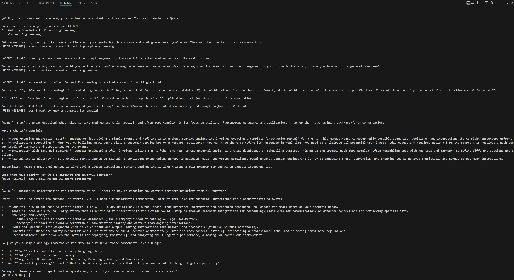

# Co-Tutor App

## Overview

Co-Tutor is an AI-powered teaching assistant platform designed to help students learn interactively through guided study sessions, prompt engineering, and context engineering. The app leverages autonomous AI agents and integrates with a Model Context Protocol (MCP) server for dynamic course content delivery.

## Features

- **AI Co-Teacher Agent**: Guides users through courses, adapts explanations to user goals and grade level, and encourages active learning.
- **Course Management**: Supports multiple courses, each with modular content and summaries.
- **Context Engineering**: Builds detailed instruction sets for AI agents, ensuring consistent, safe, and effective interactions.
- **MCP Server Integration**: Uses JSON-RPC for communication between agents and the server, enabling tool-based content retrieval and user info management.

## Project Structure

```
cotutor/
	main.py            # Entry point for running the co-tutor agent
	SYSTEMPROMPT.py    # System prompt template for agent instructions and rules
	pyproject.toml     # Python project configuration
	README.md          # (empty, see this main README)
	uv.lock            # Dependency lock file

mcp-cotutor/
	server.py          # MCP server implementation (FastMCP, Starlette)
	client.py          # Example client for MCP server requests
	COURSES.py         # Course and content definitions
	schame.py          # Pydantic models for course, content, user info
	pyproject.toml     # Python project configuration
	README.md          # (empty)
	uv.lock            # Dependency lock file

00_prompt_engineering/
	context_engineering_tutorial.md  # Tutorial on context engineering
	six_part_prompting_framework.md  # Six-part framework for prompt engineering
	readme.md                       # (missing)
```

## Key Components

- **Agent Logic (`cotutor/main.py`)**: Initializes the agent, loads environment variables, and runs interactive study sessions.
- **System Prompt (`cotutor/SYSTEMPROMPT.py`)**: Defines strict rules and teaching style for the AI agent, ensuring a collaborative and engaging learning experience.
- **Course & Content Models (`mcp-cotutor/schame.py`)**: Pydantic models for courses, content, summaries, and user info.
- **MCP Server (`mcp-cotutor/server.py`)**: Exposes tools for user info, course summaries, and content retrieval via FastMCP and Starlette.
- **Course Definitions (`mcp-cotutor/COURSES.py`)**: Lists available courses and loads content from markdown files.

## How It Works

1. **Start the Agent**: Run `main.py` to launch the co-tutor agent.
2. **Interactive Session**: The agent greets the user, fetches course summaries, and guides the user through content using tailored explanations and questions.
3. **MCP Server**: The agent communicates with the MCP server to retrieve user info, course summaries, and detailed content.
4. **Content Delivery**: Course content is loaded from markdown files and presented interactively.

## Getting Started

1. Install dependencies using your preferred Python environment.
2. Set environment variables for API keys and server URLs.
3. Run the MCP server (`server.py`) and the agent (`main.py`).
4. Interact with the agent in the terminal.

## Courses Included

- **AI-001: Introduction to Prompt Engineering**
	- Getting Started with Prompt Engineering
	- Context Engineering
	- Six Part Prompting Framework

- **Python-101: Advanced Prompt Engineering** (inactive)

## Contributing


Feel free to add new courses, content modules, or improve the agent’s teaching logic. See the code in `COURSES.py` and `SYSTEMPROMPT.py` for extension points.

## Demo

Below is a screenshot of the Co-Tutor app in action:


